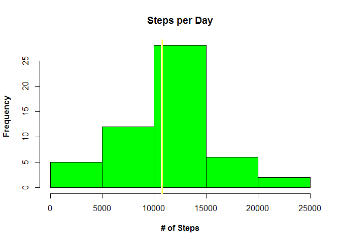

How weekends activity differs from weekdays?
--------------------------------------------

### This report is part of the Reproducible Reserarch Course from Coursera

#### *Claudia Werneck* <http://www.github.com/cwerneck>

#### *July 31, 2016*

During the weekdays, people rush to reach their offices and then, stay almost the time in their chairs.
On weekends, they are free to move any time they wants and it is logical to expect more activity than the weekdays.

**Is this true?** How can we manage to get some data to undesrtand the activity of working people?

Today there are devices that permits that simply carring the device attached on the leg, get lots of information, including the number of steps in each slice of 5 minutes, all day long.

Using the data of two month observation, let's do some analyses do test our guess.

#### **1 - Install some libraries with functionalities we will need:**

``` r
library(knitr)        # 'knits' code, text and information to create the document in HTML
library(lubridate)    # Manage Date
```

    ## 
    ## Attaching package: 'lubridate'

    ## The following object is masked from 'package:base':
    ## 
    ##     date

``` r
library(ggplot2)      # Powerfull library for graphs and plotts
```

#### **2 - Read the data from the activity monitoring devices, that comes with three columns:**

##### the number of **steps** couted in this interval

##### Date in **YYYY-MM-DD** format

##### **Number** of the interval - each day starting with 0 and going until 2355

``` r
activity <- read.csv("C:/Coursera/05_RepData/Assignment1/activity.csv", header=TRUE)  
activity$date <- as.Date(as.character(activity$date), "%Y-%m-%d")
```

#### **3 - Obtain the mean and the median values**

In this case, lets work with a data set where the missing values, 'NA', where excluded.

``` r
activity.noNA <- na.omit(activity)       # Remove missing values 

steps.per.day<-aggregate(activity.noNA$steps, by=list(activity.noNA$date), sum)
```

Lets obtain the mean values of the dataset:

``` r
(mean.steps<-mean(steps.per.day$x))
```

    ## [1] 10766.19

And the median:

``` r
(median.steps<-median(steps.per.day$x))
```

    ## [1] 10765

##### **OK. So, in this dataset, the mean number of steps daily is 10.766 and the median 10.765 steps per day**

#### **4 - Display the steps per day using an histogtam**

Doing so, it is possible visualize the position of the meaning value for number of steps per day

``` r
hist(steps.per.day$x, col= "green", main = "Steps per Day", 
     font.main = 2, cex.main = 1.2, xlab = "# of Steps", font.lab = 2 )
abline(v=mean.steps, col="yellow", lwd = 4)
abline(v=median.steps, col="white", lwd = 2)
```

 \#\#\#\#\#Now, we will find the interval with most number of steps

``` r
steps.per.interval = aggregate(activity.noNA$steps, by=list(interval = activity.noNA$interval), FUN=mean)
steps.per.interval$interval <- round(steps.per.interval$interval, 0)        # Round to integers for plots
colnames(steps.per.interval) <- c("interval", "steps")
(max.interval <- steps.per.interval[which.max(steps.per.interval$steps), ]) # Interval with maximum steps  
```

    ##     interval    steps
    ## 104      835 206.1698

``` r
plot(steps.per.interval, type = "l", col = "darkgray", lwd = 2.5, ylab = "# of Steps", font.lab = 2,
     main = "Average Daily Activity Pattern", xlab = "Interval" )
abline(v = 835, col = "red", lw = 1.5); text(1200, 180, paste("Maximum = 835"), col="red", cex=.75)  
```


Lets find the number of missing values:

``` r
sum(is.na(activity$steps))  
```

    ## [1] 2304

#### **The number of missing values is 2.304.**

#### **Filling tyhe missing values**

The missing values will be filled with the average number of steps for the interval that misses the value.

``` r
steps.average <- aggregate(steps ~ interval, data = activity, FUN = mean)
fillNA <- numeric()
for (i in 1:nrow(activity)) { obs <- activity[i, ]
    if (is.na(obs$steps)) {steps <- subset(steps.average, interval == obs$interval)$steps } 
    else {steps <- obs$steps}
    fillNA <- c(fillNA, steps) }
activity.fill <- cbind(activity[ , -1], fillNA)             # Create new dataset with imputed values filled
activity.fill$fillNA <- round(activity.fill$fillNA, 2); 
names(activity.fill)[3] <- "steps"
```

``` r
fill.steps.per.day  <- aggregate(activity.fill$steps, by = list(activity.fill$date), FUN = sum)

colnames(fill.steps.per.day) <- c("date", "steps")

plot3 <- ggplot(fill.steps.per.day, aes(x = steps)) + 
         geom_histogram(fill = "orange", binwidth = 1000)+ theme_bw() + 
         labs(title = "Histogram: Daily Total Steps Taken", x = "Number of Steps per Day", y = "Day Count") + 
         theme(axis.text = element_text(size = 12), axis.title = element_text(face = "bold"),
               panel.grid.major = element_blank(), panel.grid.minor = element_blank())
plot3 + geom_vline(xintercept=10766, color="blue", size = 1.2) +
        annotate("text", x = 14000, y=15, label = "Mean = 10,766", color="blue")
```


##### **New values for mean and median**

Now that the missing values were filled with the mean value of steps in that especific interval, we must fins the nex values for mean and media:

``` r
(steps.mean.fill   <- round(mean(fill.steps.per.day$steps), 2))  
```

    ## [1] 10766.18

``` r
(steps.median.fill <- round(median(fill.steps.per.day$steps), 2))  
```

    ## [1] 10766.13

##### The new value of mean steps taken per day, with the dataset filled is **10,766.18** and the median, **10,766.13**

#### For this two data, we can say that the two values differ very little. The difference may be will show comparing the distribution of the steps separating the weekdays from the weekend days. In this two follow graphics the steps per interval could be compared:
